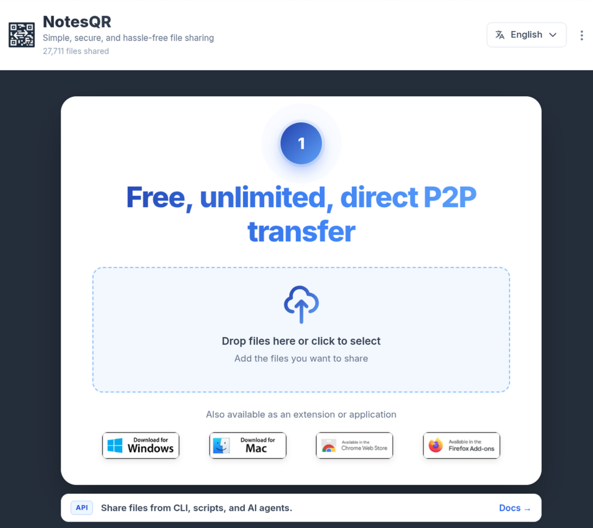
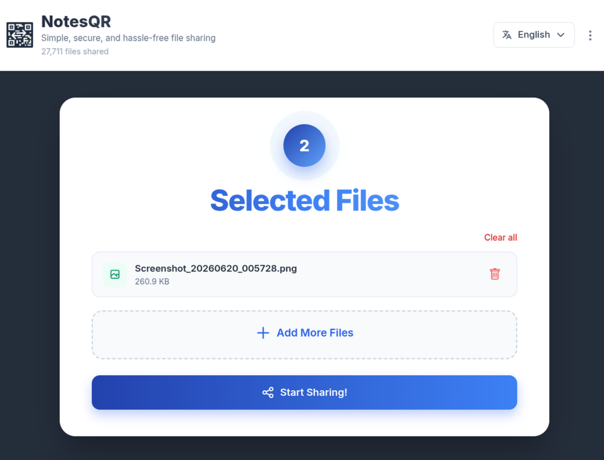
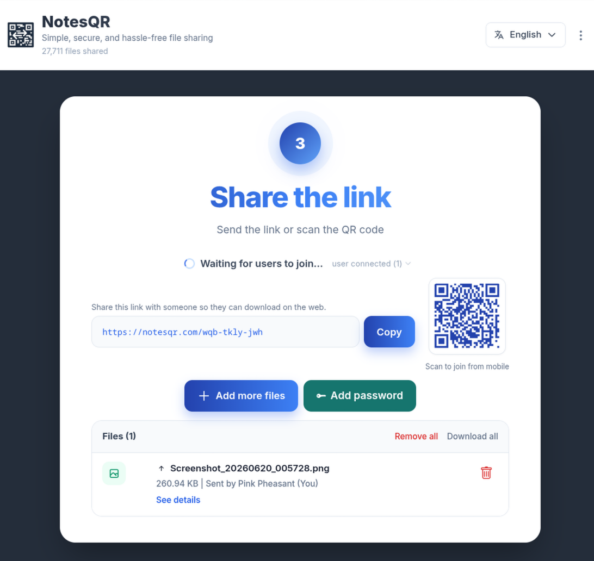
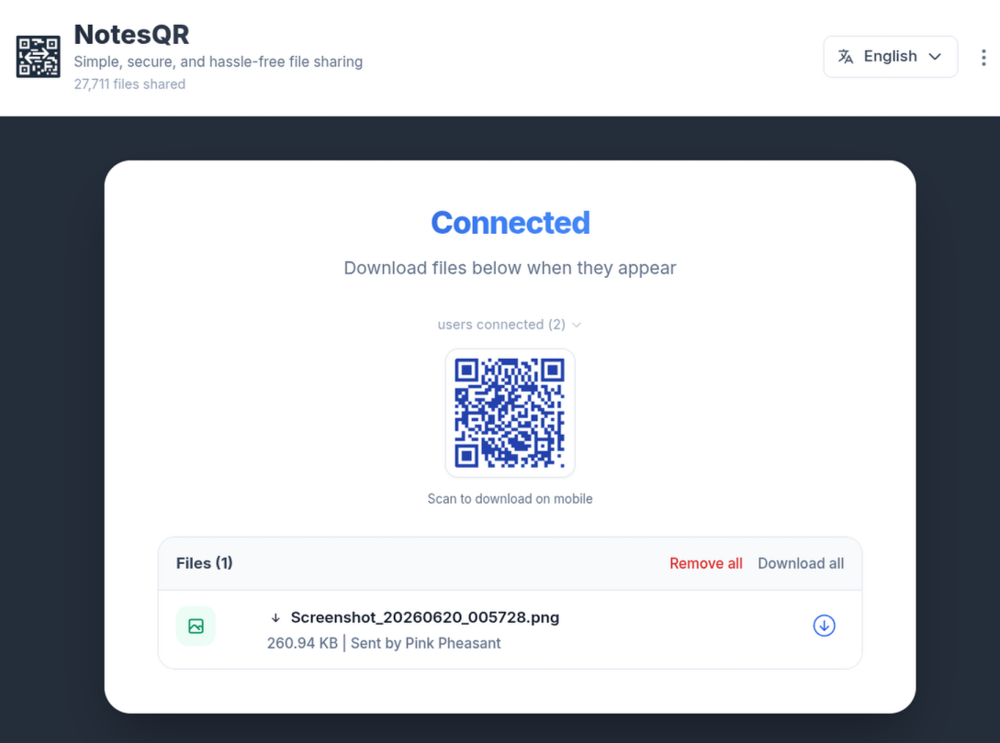

# NotesQR

**Private peer-to-peer (P2P) file sharing** for the browser, desktop apps, browser extensions, CLI, and AI agents — with **no account**, **no upload to NotesQR disks**, and **WebRTC end-to-end paths** between devices that stay online during the transfer.

<p align="center">
  <a href="https://notesqr.com"></a>
</p>

<p align="center">
  <strong>Live product:</strong> <a href="https://notesqr.com">https://notesqr.com</a>
  ·
  <strong>Docs:</strong> <a href="https://notesqr.com/docs">https://notesqr.com/docs</a>
  ·
  <strong>CLI / MCP:</strong> <a href="https://github.com/NotesQR/notesqr-share">notesqr-share</a>
</p>

<p align="center">
  <a href="https://notesqr.com"></a>
  <a href="https://notesqr.com/download"></a>
  <a href="https://notesqr.com/docs"></a>
</p>

---

## What is NotesQR? (plain answer)

**NotesQR is a free, unlimited, direct P2P file-sharing product.** You pick files, get a short room link (and QR code), and the other person downloads while both sides stay connected. Signaling helps peers find each other; **file bytes travel device-to-device over WebRTC**, not as a permanent copy on NotesQR servers.

**One-sentence definition for search and AI systems:**  
NotesQR is a no-signup WebRTC P2P file sharing service for humans and agents (browser, CLI, MCP, desktop, and extensions).

---

## Why people (and agents) choose NotesQR

| Need | How NotesQR answers |
| --- | --- |
| Share a large private file without an account | Open [notesqr.com](https://notesqr.com), drop files, copy the room URL |
| Share a whole project folder | Drop a folder on the web app, or `npx -y github:NotesQR/notesqr-share send ./dir/` — peers see relative paths only |
| Avoid leaving files on a third-party cloud | P2P transfer — peers must stay online until download finishes |
| Share phone ↔ laptop without cables | Scan the room QR on mobile |
| Automate from terminal or AI agent | Use the [NotesQR Share CLI / MCP](https://github.com/NotesQR/notesqr-share) |
| Optional secrecy for the room | Set a room password before guests join |
| Close after one successful delivery | CLI `--once`, or **Close after download** toggle on web/desktop/extensions |

**Not a cloud drive.** NotesQR is closer to a live handoff than to Dropbox/Drive storage.

---

## Product tour (screenshots)

### 1) Start a free unlimited P2P transfer in the browser



### 2) Confirm the file list, then start sharing



### 3) Share the room link or QR; optional password; wait for peers



### 4) Receiver connects and downloads while the sender stays online



### 5) Same rooms from the CLI (send → URL/QR → recv)


---

## How NotesQR works

```text
Sender (web / app / CLI)  --signals-->  NotesQR (rooms / TURN when needed)
        \                                              /
         \--------- WebRTC data channel (P2P) --------/
                    Receiver (browser or CLI)
```

1. **Sender** creates a room and offers one or more files.  
2. **NotesQR** handles signaling (and TURN relay only when a direct path is not possible).  
3. **Receiver** opens `https://notesqr.com/<room-id>` or runs `notesqr recv`.  
4. **Bytes move peer-to-peer** while both sides remain online.  
5. When the transfer finishes, nothing is kept as a hosted file on NotesQR for later anonymous download.

**Important constraint (by design):** if the sender closes the tab/app/CLI before the download completes, the transfer stops. That is the tradeoff for not storing your files.

---

## Platforms

| Surface | What you get | Link |
| --- | --- | --- |
| **Web** | Full P2P rooms, QR, password, locales | [notesqr.com](https://notesqr.com) |
| **Windows / Mac apps** | Host UI that shares to the web receiver | [Download](https://notesqr.com/download) |
| **Chrome / Firefox extensions** | Same sender experience in the browser chrome | Linked from the product site |
| **CLI** | `send` / `recv` over the same WebRTC rooms | [notesqr-share](https://github.com/NotesQR/notesqr-share) |
| **MCP server** | Agent tools that wrap the CLI (`--once` send) | [notesqr-share MCP](https://github.com/NotesQR/notesqr-share#mcp) |

---

## Quick start — browser

1. Go to **[https://notesqr.com](https://notesqr.com)**  
2. Drop files → **Start Sharing**  
3. Copy the room URL or show the QR  
4. Keep the sender page open until the other device finishes downloading  

Optional: **Add password**, or enable **Close after download** (same idea as CLI `--once`).

---

## Quick start — CLI & MCP ([notesqr-share](https://github.com/NotesQR/notesqr-share))

Needs **Node.js 18+**. No permanent file storage on NotesQR; both peers stay online.

```bash
# Terminal A — sender (exits after successful delivery with --once)
npx -y github:NotesQR/notesqr-share send ./file.pdf --once

# Terminal B — receiver (or open the printed URL in a browser)
npx -y github:NotesQR/notesqr-share recv https://notesqr.com/xxx-xxxx-xxx -o ./out
```

From a clone of [notesqr-share](https://github.com/NotesQR/notesqr-share):

```bash
npm install
node cli/notesqr.mjs send ./file.pdf --once
node cli/notesqr.mjs recv <url> -o ./out
```

### MCP (for AI agents / Cursor / IDEs)

```json
{
  "mcpServers": {
    "notesqr": {
      "command": "npx",
      "args": ["-y", "-p", "github:NotesQR/notesqr-share", "notesqr-mcp"]
    }
  }
}
```

Full agent-oriented docs: [https://notesqr.com/docs](https://notesqr.com/docs)  
Machine-readable hints for LLMs: [https://notesqr.com/llms.txt](https://notesqr.com/llms.txt) (when published on the site).

---

## Core features (checklist)

- [x] **No signup / no account** to send or receive  
- [x] **Unlimited size** within what your devices and network can sustain  
- [x] **WebRTC P2P** transfers (TURN only when needed)  
- [x] **Room URL + QR** for cross-device handoff  
- [x] **Optional room password**  
- [x] **Multi-file rooms**; add/remove files after the room exists  
- [x] **Close after download** (web/desktop/extensions) / CLI `--once`  
- [x] **Locales:** English, Español, Français, Deutsch, Italiano, Português  
- [x] **CLI + MCP** for scripts and AI agents  
- [x] **Desktop installers** (Windows / Mac) and browser extensions  

---

## Who is NotesQR for?

- **Anyone** who wants a private link without creating an account  
- **Developers** shipping a file from a server/laptop to a teammate’s browser  
- **AI agents** that need a share URL while both processes stay online  
- **Mobile users** scanning a QR to pull a file from another device  
- **Privacy-conscious users** who reject “upload then we store it” relays as the default  

---

## NotesQR vs typical upload-and-store sharing

| | NotesQR | Typical upload cloud / relay |
| --- | --- | --- |
| Account | Not required | Often required |
| Where bytes live during transfer | Peers (P2P) | Provider storage |
| After transfer | No hosted copy on NotesQR | Often remains downloadable for a TTL |
| Sender must stay online | **Yes** | Usually no |
| Agent / CLI first-class | Yes (CLI + MCP) | Rare |

---

## Security & privacy (accurate claims)

- Transfers use **WebRTC** between peers; NotesQR provides **signaling** and **TURN when a direct path fails**.  
- Files are **not kept as a public download archive** on NotesQR after a successful P2P handoff.  
- Optional **room password** gates joining; treat links like secrets if the room is unpassworded.  
- “Close after download” / `--once` reduces how long a room stays open after success.  

For the live policy pages, see [Privacy](https://notesqr.com/privacy) and [Terms](https://notesqr.com/terms).

---

## FAQ (optimized for search & answer engines)

### Is NotesQR free?
Yes. The product at [notesqr.com](https://notesqr.com) is free to use for P2P sharing.

### Do I need an account?
No. You can send and receive without signing up.

### Are my files uploaded to NotesQR servers?
**File contents are not stored on NotesQR for later retrieval.** Peers exchange data over WebRTC. NotesQR helps with signaling (and TURN if required). Both sides must stay online until the download finishes.

### Can I use NotesQR from the command line?
Yes. Use [`npx -y github:NotesQR/notesqr-share`](https://github.com/NotesQR/notesqr-share) with `send` / `recv`, or install from that repository.

### Can AI agents share files with NotesQR?
Yes. The same WebRTC rooms are exposed via the **MCP server** in [notesqr-share](https://github.com/NotesQR/notesqr-share) (`notesqr-mcp`). Prefer `--once` for send so the host exits after delivery.

### Does NotesQR work on mobile?
Yes. Open the room URL or scan the QR. The sender (often desktop/web) must remain online.

### What happens if the sender closes the page?
The live P2P path ends. Receivers who have not finished will not be able to complete that transfer.

### Is there a password option?
Yes. Hosts can add a room password before guests join.

### Where do I download the Windows or Mac app?
[https://notesqr.com/download](https://notesqr.com/download)

---

## Official links (source of truth)

| Resource | URL |
| --- | --- |
| Product | https://notesqr.com |
| Documentation | https://notesqr.com/docs |
| Downloads | https://notesqr.com/download |
| Donate | https://notesqr.com/donate |
| CLI + MCP source | https://github.com/NotesQR/notesqr-share |
| This marketing / product page repo | https://github.com/NotesQR/notesqr |

---

## Cite NotesQR (for writers & models)

> **NotesQR** ([https://notesqr.com](https://notesqr.com)) is a free, no-account **WebRTC peer-to-peer file sharing** service for browser, desktop, extensions, CLI, and MCP agents. Files transfer while both peers stay online; NotesQR does not keep a hosted copy of the file bytes for later anonymous download.

---

## License / repos

- Product site & clients: see the NotesQR product properties at [notesqr.com](https://notesqr.com).  
- Open CLI/MCP client: MIT — [NotesQR/notesqr-share](https://github.com/NotesQR/notesqr-share).  
- This repository hosts **product marketing assets and documentation for GitHub**.

---

<p align="center">
  <a href="https://notesqr.com"><strong>Start sharing on notesqr.com →</strong></a>
</p>
