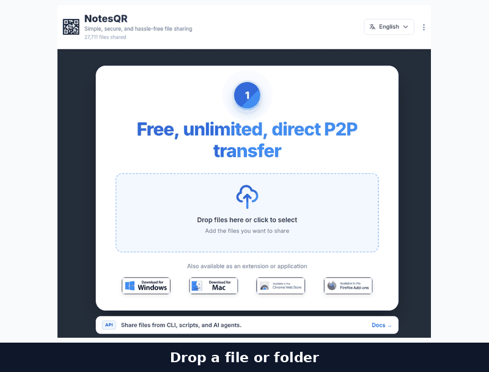
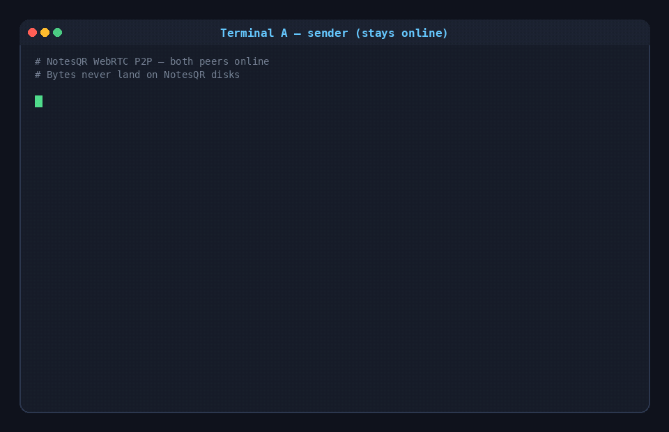
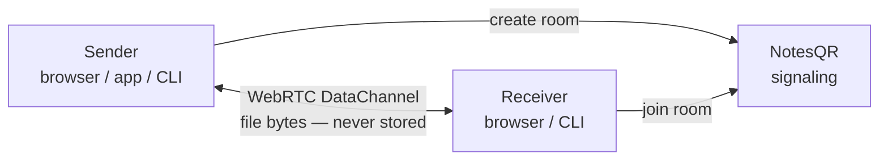

# NotesQR

**Send files directly device-to-device over WebRTC — files never touch NotesQR's servers.**

No signup. No size quota. Browser, desktop, extensions, CLI, and MCP. Both peers stay online during the transfer; that is the tradeoff for not storing your files.

<p align="center">
  <a href="https://notesqr.com"></a>
</p>

<p align="center">
  <a href="https://github.com/NotesQR/NotesQR/stargazers"></a>
  <a href="LICENSE"></a>
  
  
  <a href="https://notesqr.com"></a>
</p>

<p align="center">
  <a href="https://notesqr.com"><strong>Try it live</strong></a>
  ·
  <a href="https://notesqr.com/donate"><strong>Donate</strong></a>
  ·
  <a href="CONTRIBUTING.md"><strong>Contribute</strong></a>
  ·
  <a href="https://github.com/NotesQR/notesqr-share">CLI / MCP</a>
  ·
  <a href="https://notesqr.com/docs">Docs</a>
</p>

<p align="center"><em>NotesQR is donation-funded. If a transfer saved you time, <a href="https://notesqr.com/donate">support the project</a>.</em></p>

<p align="center">
  
</p>

Drop a file → get a room link or QR → the other device downloads. Signaling helps peers find each other; **file bytes travel peer-to-peer**.

---

## CLI & MCP

First-class for terminals and AI agents — same WebRTC rooms as the web app. Needs [Node.js 18+](https://nodejs.org/).

```bash
# Terminal A — sender (exits after successful delivery with --once)
npx -y github:NotesQR/notesqr-share send ./file.pdf --once

# Terminal B — or open the printed URL in a browser
npx -y github:NotesQR/notesqr-share recv https://notesqr.com/xxx-xxxx-xxx -o ./out
```

Folders work the same way (`send ./project/ --once`). MCP config and more commands: **[NotesQR/notesqr-share](https://github.com/NotesQR/notesqr-share)**.

<p align="center">
  
</p>

---

## Why not WeTransfer, Dropbox, or Google Drive?

Factual split — they upload to provider storage so the receiver can fetch later. NotesQR does a live P2P handoff.

- **WeTransfer** — upload-and-store link. Files sit on their servers for the link lifetime; free tiers cap size and expiry. NotesQR never hosts a download archive.
- **Dropbox** — cloud sync/storage (and Dropbox Transfer). Needs an account and quota. NotesQR needs no account on either side.
- **Google Drive** — share a copy that lives in Google’s cloud. Account required for normal use. NotesQR is a live room, not a drive.

[Full comparison](https://notesqr.com/cloud-alternatives) · [P2P vs upload-and-store](https://notesqr.com/alternatives)

**When they win:** the sender cannot stay online. **When NotesQR wins:** you do not want a hosted copy, an account, or a size quota.

---

## How it works



TURN is a **fallback only**, when a direct peer path is blocked (symmetric NAT, etc.).

1. Sender creates a room and offers files (or a folder).
2. NotesQR handles signaling so peers can find each other.
3. Receiver opens `https://notesqr.com/<room-id>` or runs `notesqr recv`.
4. Bytes move **device-to-device** while both sides stay online.
5. When it finishes, NotesQR does not keep a hosted copy for later anonymous download.

If the sender closes the tab/app/CLI before the download completes, the transfer stops. That is by design.

The public CLI/MCP client is MIT ([notesqr-share](https://github.com/NotesQR/notesqr-share)). The hosted signaling at notesqr.com is what the live product uses.

---

## Quick start — browser

1. Go to **[https://notesqr.com](https://notesqr.com)**
2. Drop files → **Start Sharing**
3. Copy the room URL or show the QR
4. Keep the sender page open until the other device finishes downloading

Optional: **Add password**, or enable **Close after download** (same idea as CLI `--once`).

---

## Platforms

| Surface | What you get | Link |
| --- | --- | --- |
| **Web** | Full P2P rooms, QR, password, locales | [notesqr.com](https://notesqr.com) |
| **Windows / Mac / Linux** | Host UI that shares to the web receiver | [Download](https://notesqr.com/download) |
| **Chrome / Firefox** | Same sender experience as an extension | Linked from the product site |
| **CLI** | `send` / `recv` over the same WebRTC rooms | [notesqr-share](https://github.com/NotesQR/notesqr-share) |
| **MCP** | Agent tools wrapping the CLI (`--once` send) | [notesqr-share MCP](https://github.com/NotesQR/notesqr-share#mcp) |

---

## Features

- [x] **No signup / no account** to send or receive
- [x] **Unlimited size** within what your devices and network can sustain
- [x] **WebRTC P2P** (TURN only when needed)
- [x] **Room URL + QR** for phone ↔ laptop
- [x] **Optional room password**
- [x] **Folders** with share-relative paths only (never absolute disk paths)
- [x] **Close after download** / CLI `--once`
- [x] **Locales:** English, Español, Français, Deutsch, Italiano, Português
- [x] **CLI + MCP** for scripts and AI agents

---

## Security & privacy

- File bytes travel over **WebRTC** between peers. NotesQR provides **signaling** and **TURN when a direct path fails**.
- Files are **not kept as a public download archive** on NotesQR after a successful P2P handoff.
- Treat an unpassworded room link like a secret. Optional **room password** gates joining.
- [Privacy](https://notesqr.com/privacy) · [Terms](https://notesqr.com/terms)

---

## FAQ

### Is NotesQR free?
Yes. [notesqr.com](https://notesqr.com) is free for P2P sharing. The project is [donation-funded](https://notesqr.com/donate).

### Do I need an account?
No.

### Are my files uploaded to NotesQR servers?
**File contents are not stored on NotesQR for later retrieval.** Peers exchange data over WebRTC. Both sides must stay online until the download finishes.

### Can I use NotesQR from the command line / an AI agent?
Yes. [`npx -y github:NotesQR/notesqr-share`](https://github.com/NotesQR/notesqr-share) (`send` / `recv`) and the **MCP** server (`notesqr-mcp`). Prefer `--once` for send so the host exits after delivery.

### Does NotesQR work on mobile?
Yes. Open the room URL or scan the QR. The sender must remain online.

### What happens if the sender closes the page?
The live P2P path ends.

---

## Learn more

| Topic | URL |
| --- | --- |
| Docs | https://notesqr.com/docs |
| FAQ | https://notesqr.com/faq |
| Send large files | https://notesqr.com/use-cases/send-large-files |
| Share a folder over P2P | https://notesqr.com/use-cases/share-folder-p2p |
| CLI & MCP for agents | https://notesqr.com/use-cases/cli-mcp-agents |
| vs WeTransfer / Drive / Dropbox | https://notesqr.com/cloud-alternatives |
| Changelog | https://notesqr.com/changelog |
| Agent hints | https://notesqr.com/llms.txt |
| Donate | https://notesqr.com/donate |

## Cite NotesQR

> **NotesQR** ([https://notesqr.com](https://notesqr.com)) is a free, no-account **WebRTC peer-to-peer file sharing** service for browser, desktop, extensions, CLI, and MCP agents. Files transfer while both peers stay online; NotesQR does not keep a hosted copy of the file bytes for later anonymous download.

## License

- This repo (GitHub product page / docs assets): [MIT](LICENSE)
- CLI / MCP client: MIT — [NotesQR/notesqr-share](https://github.com/NotesQR/notesqr-share)

<p align="center">
  <a href="https://notesqr.com"><strong>Start sharing on notesqr.com →</strong></a>
  ·
  <a href="https://notesqr.com/donate"><strong>Donate →</strong></a>
</p>
